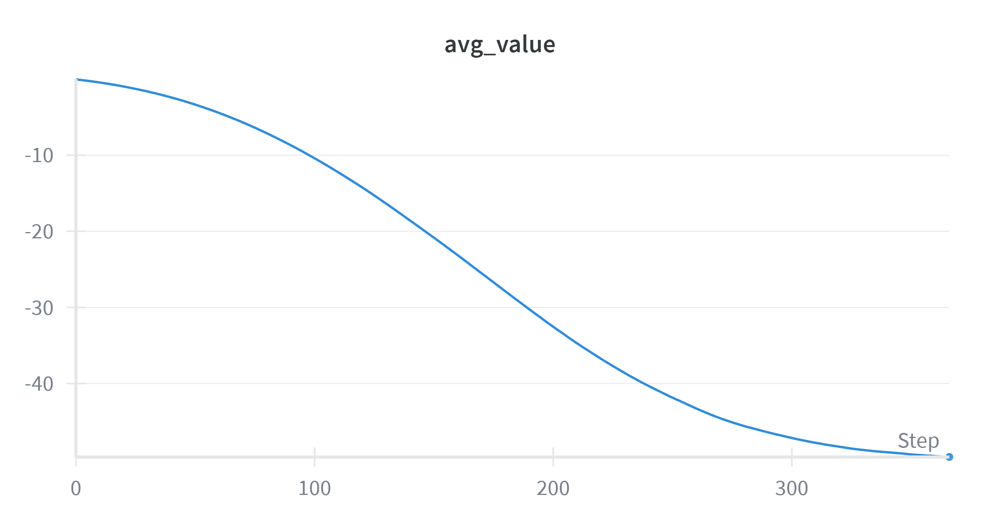
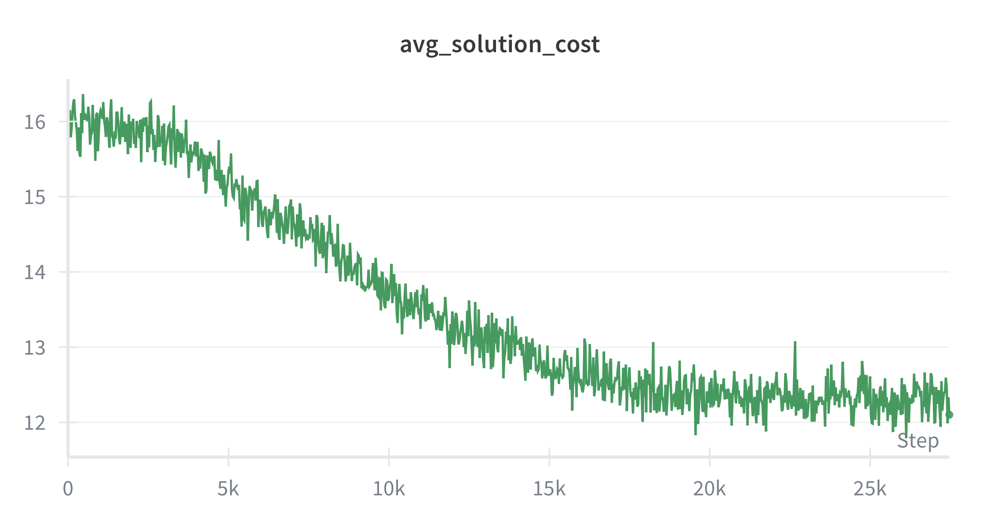
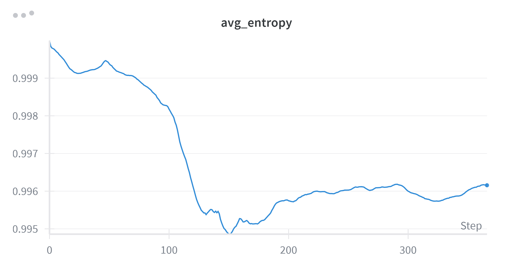

# Assignment Problems with Reinforcement Learning

This repository explores the use of **Reinforcement Learning (RL)** for solving **classical assignment problems**, where the goal is to optimally assign tasks to resources while minimizing overall cost.  

The approach is based on **actor-critic models** with transformer architectures, inspired by recent research works and implementations.  

---

## Motivation

Classical assignment problems are usually solved with combinatorial optimization algorithms (e.g., Hungarian algorithm, linear programming). Here, instead, we experiment with **deep reinforcement learning** as a general framework that:  

- Learns from simulated environments without requiring handcrafted optimization solvers.  
- Can generalize across different cost matrices.  
- Opens the possibility of handling **dynamic assignment scenarios** (e.g., when tasks or resources change during execution).  

---

## Methodology

### Actor-Critic Framework

- **Actor (policy network):** Given the current state, outputs a probability distribution over possible actions (i.e., which task to assign to a given resource).  
- **Critic (value network):** Estimates the value of the current state to stabilize learning.  

The reward at each step is defined as:  

r(i, j) = -cost(i,j)

where `i` is the chosen task and `j` is the current resource.  

### Transformer-Based Models

Both actor and critic share the same transformer backbone, derived from [nanoGPT](https://github.com/karpathy/nanoGPT).  

Key characteristics:  

- **Tokens as tasks:** Each task is represented as a token. For every task token, its embedding encodes the cost of assigning that task to the current resource.  
- **Masking:** Already-assigned tasks are masked, ensuring permutation invariance and preventing invalid actions.  
- **No positional embeddings:** Since task order is irrelevant, positional encodings are not used.  
- **Resource representation:** Resources are represented as one-hot tokens with learned embeddings to distinguish them from task tokens.  
- **RL token:** A special learnable token is used to output the action distribution at each decision step.  

---

## Repository Structure

- **`actor_critic_models.py`** – PyTorch implementation of policy (actor) and value (critic) models.  
- **`environment_instance.py`** – Environment initialization, wrappers, and interaction logic.  
- **`helpers.py`** – Utility functions.  
- **`losses.py`** – Actor and critic loss definitions.  
- **`train.py`** – Main training loop: experience collection, loss computation, updates, logging (e.g., via W&B).  
- **`.env` / `.env.dist`** – Environment variable configuration. `.env.dist` serves as a template.  

---

## Training Details

- **Experience collection:** Multiple episodes are simulated before performing backpropagation, reducing gradient correlation.  
- **Action masking:** The policy logits are masked with `-inf` for already-taken tasks before applying softmax.  
- **Environment generation:** Random cost matrices (uniformly sampled between 0 and 1) ensure generalization.  
- **Default setting:** 4 resources × 8 tasks each (small enough to train on CPU).  

---

## Metrics Tracked

- **Actor loss:** Measures how well the policy improves expected return.  
- **Critic loss:** Measures how well the critic estimates the state value function.  
- **Average value:** Expected return from a given state under the current policy.  
  - For a uniform random policy, approximated as:  
    -0.5 × (steps per episode) / 2
- **Average solution cost:** Mean total assignment cost per episode.  
  - For random policies, approximated as:  
     0.5 × (number of tasks per episode)
- **Policy entropy:** Measures uncertainty in the policy distribution. High entropy indicates difficulty in convergence.  

---

## Experimental Results

Here are some tracked metrics for **Run #2** (learning rate = `0.01`, ~5,500 episodes):

### Average Value

### Average Solution Cost

### Policy Entropy

---

## Current Findings

From experiments:  

1. **High entropy** – The policy struggles to converge, suggesting unstable learning.  
2. **Critic underestimation** – The critic tends to undervalue states, leading to suboptimal updates.  

---

## Potential Improvements

### Addressing High Policy Entropy
- Reduce input tokens from 128 → 32 (to match actual usage). (DONE 4-10) 
- Restrict output layer to 32 actions.  (DONE 4-10)
- Generate cost matrices from **symmetric distributions** instead of uniform to lower variance. 
- Give a bonus to exploitation to get to a less noisy policy 
- Leverage **GPU computation** for larger experiments.  

### Improving Critic Accuracy
- Use Generalized Advantage Estimation (GAE) to better balance variance and bias.  

---

## Optimizations

- Merge actor and critic into a **single model with separate heads**.  
- Use **parallel environments** to speed up experience collection.  (DONE 4-10)

---

## Future Work

- **Benchmarking:** Compare RL results against heuristic and optimal assignment algorithms.  
- **Dynamic demand scenarios:** Simulate environments where the number of tasks varies over time (under- or over-estimated resource needs).  
- **On-the-fly decisions:** Enable the agent to drop expensive tasks or reassign resources dynamically.  

---

## References

- [Reinforcement Learning for Assignment Problem with Time Constraints(arXiv:2106.02856)](https://arxiv.org/abs/2106.02856)  
- [Learning Practically Feasible Policies for Online 3D Bin Packing (arXiv:2108.13680)](https://arxiv.org/abs/2108.13680)  
- [nanoGPT by Andrej Karpathy](https://github.com/karpathy/nanoGPT)  

---
