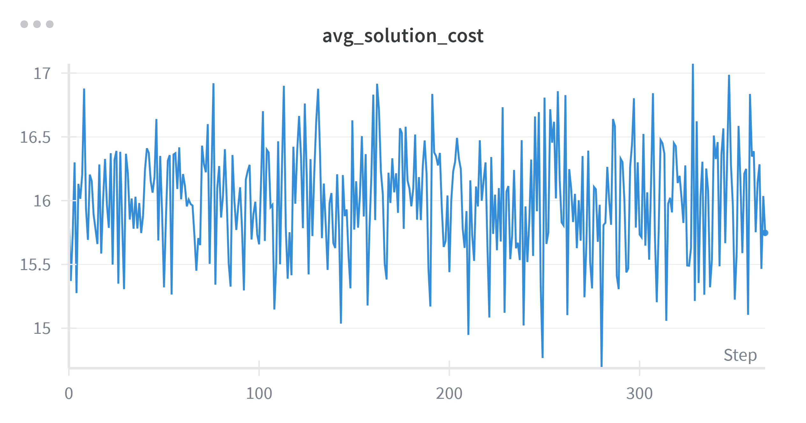

# Assignment Problems with Reinforcement Learning

## Overview
This repository investigates the use of **Reinforcement Learning (RL)** to solve the **assignment problem**, where tasks must be assigned to resources while minimizing the total solution cost. Unlike classical optimization approaches (Hungarian algorithm, ILP, greedy heuristics), this project explores whether a small transformer-based actor–critic model can learn a competitive policy.

The current system is built around:
- A lightweight **2.5K‑parameter transformer**, used by both actor and critic.
- A custom environment generating random cost matrices.
- A full RL training pipeline with entropy, solution cost, and value tracking.

---

## Methodology

### Actor-Critic Framework

- **Actor (policy network):** Given the current state, outputs a probability distribution over possible actions (i.e., which task to assign to a given resource).  
- **Critic (value network):** Estimates the value of the current state to stabilize learning.  

The reward at each step is defined as:  

r(i, j) = -cost(i,j)

where `i` is the chosen task and `j` is the current resource.  

### Transformer-Based Models

Both actor and critic share the same transformer backbone, derived from [nanoGPT](https://github.com/karpathy/nanoGPT).  

Key characteristics:  

- **Tokens as tasks:** Each task is represented as a token. For every task token, its embedding encodes the cost of assigning that task to the current resource.  
- **Masking:** Already-assigned tasks are masked, ensuring permutation invariance and preventing invalid actions.  
- **No positional embeddings:** Since task order is irrelevant, positional encodings are not used.  
- **Resource representation:** Resources are represented as one-hot tokens with learned embeddings to distinguish them from task tokens.  
- **RL token:** A special learnable token is used to output the action distribution at each decision step.  

---

## Repository Structure

- **`actor_critic_models.py`** – PyTorch implementation of policy (actor) and value (critic) models.  
- **`environment_instance.py`** – Environment initialization, wrappers, and interaction logic.  
- **`helpers.py`** – Utility functions.  
- **`losses.py`** – Actor and critic loss definitions.  
- **`train.py`** – Main training loop: experience collection, loss computation, updates, logging (e.g., via W&B). 
- **`benchmarking.py`** – Main evaluation loop: getting optimal solution cost, greedy solution cost, rl solution cost over 5k episodes and computing metrics.
- **`.env` / `.env.dist`** – Environment variable configuration. `.env.dist` serves as a template.  

---

## Training Details

- **Experience collection:** Multiple episodes are simulated before performing backpropagation, reducing gradient correlation.  
- **Action masking:** The policy logits are masked with `-inf` for already-taken tasks before applying softmax.  
- **Environment generation:** Random cost matrices (uniformly sampled between 0 and 1) ensure generalization.  
- **Default setting:** 4 resources × 8 tasks each (small enough to train on CPU). 

# Training Metrics

Below two training curves:

### Average Solution Cost

### Policy Entropy

---

# Best Model Hyperparameters
These hyperparameters come from the best-performing configuration (see `train.py` and `config.json`).

| Hyperparameter | Value |
|---------------|--------|
| Environment | Assignment_RL |
| Gamma (discount) | 0.99 |
| Actor learning rate | 0.0001 |
| Critic learning rate | 0.0001 |
| Episodes per update | 16 |
| Cost matrix std deviation | 0.1443 |
| GAE lambda | 0.9 |
| Model size | ~2.5k parameters |
| Architecture | Tiny Transformer |

---

# Evaluation
Evaluation was performed using `benchmarking.py` on a fixed set of tasks, comparing:
- **RL policy**
- **Greedy heuristic** (always picking the locally cheapest allowed assignment)
- **Optimal solver**

### Summary Table

| Method | Times Found Optimal | Mean Cost | Variance |
|--------|----------------------|-----------|-----------|
| **RL** | 3 | 12.2266 | 0.5947 |
| **Optimal solver** | – | 11.4045 | 0.3173 |
| **Greedy heuristic** | 0 | 12.4911 | 0.4515 |

### Interpretation
- The RL model is **not optimal** yet, but:
  - It **beats greedy on average**, despite being extremely small.
  - It discovers the optimal solution **occasionally**, whereas greedy never does.
- This shows that even a very small transformer can learn a **non‑myopic assignment policy**, observing the global structure rather than only local step costs.

---

# Contributions
This work introduces some contributions:

### 1. Extremely lightweight transformer (~2.5k parameters)
Despite its tiny size, the model demonstrates **generalization**, performing inference on environments with **fewer tasks than training** without retraining.

### 2. Robust masking-based action feasibility
Invalid actions (already-assigned tasks) are masked before softmax, enabling the transformer to remain permutation‑invariant.

###  3. Custom RL environment for assignment tasks
A fully configurable environment for generating random assignment matrices with tunable difficulty.

###  4. Benchmarking framework
`benchmarking.py` allows deterministic comparisons vs greedy and optimal baselines.

###  5. Resource-by-resource construction
Assignments are built one resource at a time, which keeps the policy flexible and allows plugging in hardcoded plan variations or overrides on the fly when needed.

---

# Problems Encountered & Limitations

###  Critic network overreaching
The critic sometimes overfits or becomes overly confident, destabilizing the actor updates.

### Slow training
Although improved, training remains slow for complex configurations.

### Difficult joint tuning of actor and critic learning rates
Both networks influence each other strongly; the wrong LR combination leads to divergence.

### Still sub‑optimal compared to exact solvers
RL rarely matches the optimum and has variance in performance.

---

# Next Steps

###  1. Sampling-based policy exploration
Sample from policy logits multiple times to obtain several assignment trajectories and keep the best one (Monte Carlo action selection).

###  2. Dynamic training scenarios
During training, randomly vary:
- number of tasks,
- number of resources,
- cost distribution,
- capacity fluctuations.

This better reflects real-world dynamic assignment problems.

###  3. Scaling up task sizes
Move beyond the minimal examples and validate performance on larger matrices.

###  4. Increase GAE smoothing
Raise λ to 0.95 to smooth advantages further and stabilize updates.

---

## References

- [Reinforcement Learning for Assignment Problem with Time Constraints(arXiv:2106.02856)](https://arxiv.org/abs/2106.02856)  
- [Learning Practically Feasible Policies for Online 3D Bin Packing (arXiv:2108.13680)](https://arxiv.org/abs/2108.13680)  
- [nanoGPT by Andrej Karpathy](https://github.com/karpathy/nanoGPT) 
---
